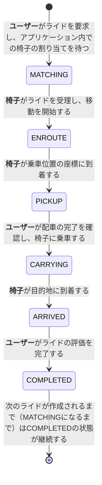
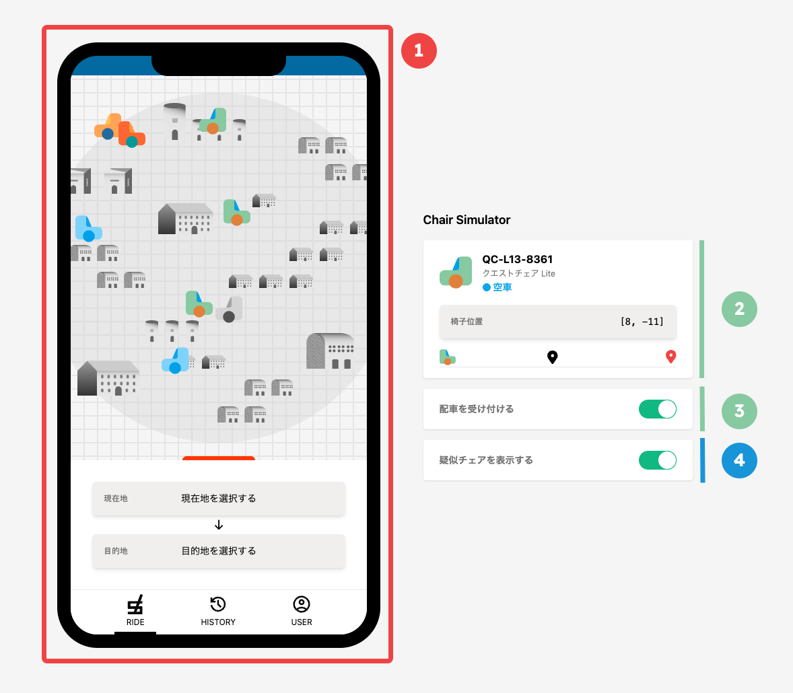

# ISURIDE アプリケーションマニュアル

<!-- TODO（公開前）: リンクの張り替え -->
[ISUCON14 当日マニュアル](./manual.md)も合わせて確認してください。

## ISURIDEとは
「電車での移動は大変…」「自家用車は駐車場代が高い…」そんなあなたにおすすめな全く新しいライドチェアサービスがISURIDEです。

ISURIDEはアプリで呼んだ椅子に座り、自動運転で目的地まで移動できるサービスです。
昨今、持続可能な社会を目指すためシェアリングエコノミーへの注目が高まっています。
また、自動運転という新たなビジネスモデルは交通事故の削減や、交通渋滞の緩和なども期待されています。

ISURIDEでは、チェアオーナーが提供する椅子をユーザーがアプリから配車リクエスト、目的地を入力して、マッチングが完了するとすぐに椅子が到着します。

利用後のライド評価システムを活用し、ユーザー・チェアオーナーともに満足度の高いライドチェアサービスを実現していきます。

利用エリアも続々拡大中！
オトクな招待キャンペーンも実施中！
今なら新規登録でますますお得に！

## 用語
### 地域（region）
- ISURIDEがサービス提供されている架空の世界に存在する、離れた2つの地域（チェアタウン・コシカケシティ）です。
- 地域およびその郊外を含めて、碁盤の目のように区画され道が整備されています。

### 距離（distance）と座標（coordinate）
- ISURIDEでの距離は、マンハッタン距離（直線距離ではなく、縦横の差の合計）で計算されます。
- 地図における座標は `latitude` と `longitude` で表されます。
  - 注：架空の世界なので、緯度が±90度を超えることがあります。軽度も±180度を超えることがあります。

### ユーザー（user）
- ISURIDEアプリを利用して実際に移動する人です。
- ユーザーは在住している地域内での移動を目的としてISURIDEを利用します。
- ユーザーは他者の招待コード経由で新規登録することで、クーポン特典を受けられます。

### 椅子（chair）
- ユーザーを載せて移動する自律運転式の椅子です。
- 椅子はISURIDEアプリを通じてユーザーに配車されます。
- 椅子には移動速度の異なるモデルが複数存在します。ユーザーの待機時間や全体としての流動性を考慮して割り当てを行うことが望ましいです。
- 椅子は自律運転で移動しますが、必ずしも最短の経路で移動するわけではありません。
- 椅子は正しく位置履歴を記録するために、位置情報を更新するリクエストが成功したことを確認するまでは、移動しません。

### オーナー（owner）
- ISURIDEで椅子を運用している企業・個人です。
- 椅子を運用することで収益を上げることを目的としています。
- オーナーは定期的に自分の管理している椅子の収益を確認し、十分に収益が上げられていることを確認すると更なる椅子の導入を検討します。

### ライド（ride）
- ライドとは「ユーザーがISURIDEアプリを通じて椅子を呼び出し、椅子に乗って移動した後、評価を行うまでの一連の流れのこと」を指します。
- ユーザーは自分が要求したライドが `COMPLETED` になるまで、他のライドを要求することができません。
- 椅子は自分に割り当てられたライドが `COMPLETED` になるまで、他のライドを受理することができません。
- `COMPLETED` に遷移する際、ユーザーはそのライドに対して評価を行います。
  - この評価はアプリの評判に影響を与えるため、高い評価はユーザー数の増加に繋がります。
  - 評価には以下のような項目が関係していることが知られています。
    - 配車を依頼してから実際に椅子が割り当てられるまでの時間。
    - 割り当てられた椅子が乗車位置に早く到着しそうかどうか（乗車位置に近い椅子が割り当てられていたり、遠くても速い椅子が割り当てられている場合が好ましい）
    - 椅子が割り当てられてから、ユーザーが乗車できるまでの時間。
    - ユーザーが乗車してから目的地に到着するまでの時間。
- 配車依頼にかかる運賃は、クーポンを使用しない場合、`500（固定利用料金）+ 乗車位置と目的地の間の距離 * 100`円です。ライドに対して評価を行った時点でユーザーに請求されます。

ライドは `MATCHING`, `ENROUTE`, `PICKUP`, `CARRYING`, `ARRIVED`, `COMPLETED` の6つの状態を持ちます。

それぞれの状態は以下のように遷移します。



### クーポン (coupon)
- ユーザーはクーポンを付与されることで運賃の割引を受けられます。
- ユーザーに付与されている未使用のクーポンは、次回以降の配車依頼において付与された順番に必ず使用されます。
- クーポンによる割引は、固定利用料金を除いた運賃に適用されます。1回の配車依頼で使い切れなかった余剰分は破棄されます。
- 現在、ユーザーはクーポンを以下方法で受け取ることができます。
  - 新規登録キャンペーン
    - 本日以降の新規登録ユーザーは初回配車依頼に使える最大3000円引きクーポンが必ず付与されます
  - 知り合い招待（招待する側）
    - 自身の招待コードを経由して他者が新規登録した場合、招待したユーザーに1000円引きクーポンが付与されます。
    - 招待は最大3人まで行うことができます。
  - 知り合い招待（招待される側）
    - 他者の招待コードを経由して新規登録したユーザーは、1500円引きクーポンが付与されます。
    - 新規登録キャンペーンによるクーポンも同時に受け取ることになりますが、新規登録キャンペーンによるクーポンの方が優先して使用されます。

## 通知エンドポイント
ISURIDEではクライアントにライドの状態の変化を通知するための2つのエンドポイントが実装されています。
- ユーザー向け通知： `/api/app/notification`
- 椅子向け通知： `/api/chair/notification`

これらはリファレンス実装では通常のJSONレスポンスを返すエンドポイントですが、[SSE(Server-Sent Events)](https://developer.mozilla.org/ja/docs/Web/API/Server-sent_events/Using_server-sent_events)を利用してリアルタイム通知を実装することも可能です。
どちらの実装においても、状態が変更されてから3秒以内に通知されていることが期待されます。

### JSONレスポンス
- サーバーがJSONレスポンスを返す場合、クライアントはポーリングによってライドの状態の変化を取得します。
- Content-Typeは `application/json` です。
- クライアントはレスポンスの `retry_after_ms` で指定された時間(ms)が経過した後に再度リクエストを送信します。
  - リファレンス実装では30ms後に再度リクエストを送信するようになっています。

### SSE(Server-Sent Events)
- サーバーがSSEを利用してリアルタイム通知を行う場合、クライアントはSSEのコネクションからライドの状態の変化を取得します。
- Content-Typeは `text/event-stream` です。
- 通知メッセージは `data: ` に続けて、webappディレクトリに存在するopenapi.yamlの `components.schemas.UserNotificationData` または `components.schemas.ChairNotificationData` のJSON文字列を返します。
  - これはJSONレスポンスの `data` に相当します。
  - 通知メッセージは1行で記述し、最後に改行を入れる必要があります。
  - 実際のレスポンス例は以下を参照してください。
- クライアントとの間にSSEのコネクションを確立した後、即座に最新のライドの状態を送信しなければなりません
- その後は随時最新のライドの状態を送信します。
  - 状態が変わった時のみ即座に送信することが望ましいです。

以下はSSEでの通知レスポンスの例です。

#### ユーザー向け通知
```
data: {"ride_id":"01JEG4X2TZSE169T99XERS990M","pickup_coordinate":{"latitude":0,"longitude":0},"destination_coordinate":{"latitude":20,"longitude":20},"fare":1500,"status":"ENROUTE","chair":{"id":"01JDFEF7MGXXCJKW1MNJXPA77A","name":"QC-L13-8361","model":"クエストチェア Lite","stats":{"total_rides_count":1,"total_evaluation_avg":5}},"created_at":1733561322336,"updated_at":1733561322690}

data: {"ride_id":"01JEG4X2TZSE169T99XERS990M","pickup_coordinate":{"latitude":0,"longitude":0},"destination_coordinate":{"latitude":20,"longitude":20},"fare":1500,"status":"PICKUP","chair":{"id":"01JDFEF7MGXXCJKW1MNJXPA77A","name":"QC-L13-8361","model":"クエストチェア Lite","stats":{"total_rides_count":1,"total_evaluation_avg":5}},"created_at":1733561322336,"updated_at":1733561322690}

data: {"ride_id":"01JEG4X2TZSE169T99XERS990M","pickup_coordinate":{"latitude":0,"longitude":0},"destination_coordinate":{"latitude":20,"longitude":20},"fare":1500,"status":"CARRYING","chair":{"id":"01JDFEF7MGXXCJKW1MNJXPA77A","name":"QC-L13-8361","model":"クエストチェア Lite","stats":{"total_rides_count":1,"total_evaluation_avg":5}},"created_at":1733561322336,"updated_at":1733561322690}

data: {"ride_id":"01JEG4X2TZSE169T99XERS990M","pickup_coordinate":{"latitude":0,"longitude":0},"destination_coordinate":{"latitude":20,"longitude":20},"fare":1500,"status":"CARRYING","chair":{"id":"01JDFEF7MGXXCJKW1MNJXPA77A","name":"QC-L13-8361","model":"クエストチェア Lite","stats":{"total_rides_count":1,"total_evaluation_avg":5}},"created_at":1733561322336,"updated_at":1733561322690}

data: {"ride_id":"01JEG4X2TZSE169T99XERS990M","pickup_coordinate":{"latitude":0,"longitude":0},"destination_coordinate":{"latitude":20,"longitude":20},"fare":1500,"status":"CARRYING","chair":{"id":"01JDFEF7MGXXCJKW1MNJXPA77A","name":"QC-L13-8361","model":"クエストチェア Lite","stats":{"total_rides_count":1,"total_evaluation_avg":5}},"created_at":1733561322336,"updated_at":1733561322690}

data: {"ride_id":"01JEG4X2TZSE169T99XERS990M","pickup_coordinate":{"latitude":0,"longitude":0},"destination_coordinate":{"latitude":20,"longitude":20},"fare":1500,"status":"CARRYING","chair":{"id":"01JDFEF7MGXXCJKW1MNJXPA77A","name":"QC-L13-8361","model":"クエストチェア Lite","stats":{"total_rides_count":1,"total_evaluation_avg":5}},"created_at":1733561322336,"updated_at":1733561322690}

data: {"ride_id":"01JEG4X2TZSE169T99XERS990M","pickup_coordinate":{"latitude":0,"longitude":0},"destination_coordinate":{"latitude":20,"longitude":20},"fare":1500,"status":"ARRIVED","chair":{"id":"01JDFEF7MGXXCJKW1MNJXPA77A","name":"QC-L13-8361","model":"クエストチェア Lite","stats":{"total_rides_count":1,"total_evaluation_avg":5}},"created_at":1733561322336,"updated_at":1733561322690}

data: {"ride_id":"01JEG4X2TZSE169T99XERS990M","pickup_coordinate":{"latitude":0,"longitude":0},"destination_coordinate":{"latitude":20,"longitude":20},"fare":1500,"status":"COMPLETED","chair":{"id":"01JDFEF7MGXXCJKW1MNJXPA77A","name":"QC-L13-8361","model":"クエストチェア Lite","stats":{"total_rides_count":2,"total_evaluation_avg":4.5}},"created_at":1733561322336,"updated_at":1733561370916}

data: {"ride_id":"01JEG4X2TZSE169T99XERS990M","pickup_coordinate":{"latitude":0,"longitude":0},"destination_coordinate":{"latitude":20,"longitude":20},"fare":1500,"status":"COMPLETED","chair":{"id":"01JDFEF7MGXXCJKW1MNJXPA77A","name":"QC-L13-8361","model":"クエストチェア Lite","stats":{"total_rides_count":2,"total_evaluation_avg":4.5}},"created_at":1733561322336,"updated_at":1733561370916}

data: {"ride_id":"01JEG4X2TZSE169T99XERS990M","pickup_coordinate":{"latitude":0,"longitude":0},"destination_coordinate":{"latitude":20,"longitude":20},"fare":1500,"status":"COMPLETED","chair":{"id":"01JDFEF7MGXXCJKW1MNJXPA77A","name":"QC-L13-8361","model":"クエストチェア Lite","stats":{"total_rides_count":2,"total_evaluation_avg":4.5}},"created_at":1733561322336,"updated_at":1733561370916}

data: {"ride_id":"01JEG4X2TZSE169T99XERS990M","pickup_coordinate":{"latitude":0,"longitude":0},"destination_coordinate":{"latitude":20,"longitude":20},"fare":1500,"status":"COMPLETED","chair":{"id":"01JDFEF7MGXXCJKW1MNJXPA77A","name":"QC-L13-8361","model":"クエストチェア Lite","stats":{"total_rides_count":2,"total_evaluation_avg":4.5}},"created_at":1733561322336,"updated_at":1733561370916}

```

#### 椅子向け通知
```plaintext
data: {"ride_id":"01JEG4X2TZSE169T99XERS990M","user":{"id":"01JEG4W4E1QF0ZA1YY4BYGA1M5","name":"CON ISU"},"pickup_coordinate":{"latitude":0,"longitude":0},"destination_coordinate":{"latitude":20,"longitude":20},"status":"MATCHING"}

data: {"ride_id":"01JEG4X2TZSE169T99XERS990M","user":{"id":"01JEG4W4E1QF0ZA1YY4BYGA1M5","name":"CON ISU"},"pickup_coordinate":{"latitude":0,"longitude":0},"destination_coordinate":{"latitude":20,"longitude":20},"status":"ENROUTE"}

data: {"ride_id":"01JEG4X2TZSE169T99XERS990M","user":{"id":"01JEG4W4E1QF0ZA1YY4BYGA1M5","name":"CON ISU"},"pickup_coordinate":{"latitude":0,"longitude":0},"destination_coordinate":{"latitude":20,"longitude":20},"status":"PICKUP"}

data: {"ride_id":"01JEG4X2TZSE169T99XERS990M","user":{"id":"01JEG4W4E1QF0ZA1YY4BYGA1M5","name":"CON ISU"},"pickup_coordinate":{"latitude":0,"longitude":0},"destination_coordinate":{"latitude":20,"longitude":20},"status":"CARRYING"}

data: {"ride_id":"01JEG4X2TZSE169T99XERS990M","user":{"id":"01JEG4W4E1QF0ZA1YY4BYGA1M5","name":"CON ISU"},"pickup_coordinate":{"latitude":0,"longitude":0},"destination_coordinate":{"latitude":20,"longitude":20},"status":"ARRIVED"}

data: {"ride_id":"01JEG4X2TZSE169T99XERS990M","user":{"id":"01JEG4W4E1QF0ZA1YY4BYGA1M5","name":"CON ISU"},"pickup_coordinate":{"latitude":0,"longitude":0},"destination_coordinate":{"latitude":20,"longitude":20},"status":"COMPLETED"}
```

### 通知の順序
どちらの通知も発生したすべての状態遷移を、発生した順序通りに、少なくとも1回以上（at least once）返す必要があります。

例えばユーザーがライドAを要求し、椅子が割り当てられ、椅子が乗車位置に到着した後、初めて通知エンドポイントにリクエストした場合を考えます。
この時、ライドAは`MATCHING` → `ENROUTE` → `PICKUP` の順で状態が遷移しているため、クライアントには下記の順序で通知を返す必要があります。
- 1回目：ライドA:`MATCHING`
- 2回目：ライドA:`ENROUTE`
- 3回目：ライドA:`PICKUP`

同様にライドAで目的地に到着し、評価を行った後にライドBを作成した後、通知エンドポイントにリクエストした場合、クライアントには下記の順序で通知を返す必要があります。
- 1回目：ライドA:`ARRIVED`
- 2回目：ライドA:`COMPLETED`
- 3回目：ライドB:`MATCHING`
- 4回目：ライドB:`ENROUTE`

## ライドのマッチング
初期状態では `isuride-matcher` というsystemdサービスがアプリケーションの `GET /api/internal/matching` を500msごとにポーリングすることで、ライドと椅子のマッチングを行う処理を起動しています。
以下の手順でマッチング間隔を変更することができます。

1. `/home/isucon/env.sh` を編集し、`ISUCON_MATCHING_INTERVAL` の値を変更します。
2. `sudo systemctl restart isuride-matcher.service` でサービスを再起動します。

なお、`GET /api/internal/matching`はインターネットには公開されず、ISURIDE 内部で利用される想定のエンドポイントのため、自由に利用方法及び仕様を変更して構いません。
`isuride-matcher.service`についても同様に、自由に利用方法及び仕様を変更して構いません。

## 決済マイクロサービス
ISURIDEを利用して目的地に到着した際、ユーザーは椅子の利用料金を支払う必要があります。
この支払い処理は社内の決済マイクロサービスを使用していますが、現在そのインフラが不安定なためリクエストが集中すると決済処理の途中でエラーが発生する可能性があります。
そのためリファレンス実装ではリクエストが失敗した場合は、リクエストをリトライする実装となっています。
この際、決済マイクロサービスから支払履歴を取得し、支払処理が完了していない場合のみリトライを行うことで、決済の重複を防いでいます。

決済マイクロサービスのAPIの詳細については`/home/isucon/webapp/payment_mock/openapi.yaml`を参照してください。

### Idempotency-Key ヘッダを利用したリクエストの重複防止
決済マイクロサービスでは、`Idempotency-Key`ヘッダを利用して決済の重複を防ぐことができます。
リクエストヘッダに`Idempotency-Key`というキーで、リクエストを一意に識別するための値を指定することで、同じ`Idempotency-Key`ヘッダを持つリクエストが複数回送信されたとしても冪等に処理されます。

### 決済マイクロサービスのモックについて
ISURIDEの開発に利用できる決済マイクロサービスのモックとして、選手に提供される各サーバーのポート12345番でHTTPサーバーが起動しています。
このモックサーバーは以下の制約を持っています。

- 決済トークンはどんなものでも受け入れる
- 決済処理は常に成功する

決済マイクロサービスのモックを停止または再起動する場合は以下のコマンドを利用してください。

```sh
sudo systemctl stop isuride-payment_mock.service
sudo systemctl restart isuride-payment_mock.service
```

なお、負荷走行後に決済マイクロサービスのモックを利用する際は、下記のように `POST /api/initialize` で決済サーバーエンドポイントを再設定してください。

```sh
curl -H 'content-type: application/json' https://isuride.xiv.isucon.net/api/initialize -d '{"payment_server": "http://localhost:12345"}'
```

## アプリケーションの概要

ISURIDEでは、利用者が使用するクライアントアプリケーション、椅子のオーナーが使用するオーナーアプリケーション、選手が動作確認を行うためのシミュレーターの3つが準備されています。

### (1) クライアントアプリケーション (/client)

クライアントアプリケーションは、ISURIDE利用者が利用することを想定した、モバイル端末向けのWebアプリケーションです。
<https://isuride.xiv.isucon.net>にアクセスし、`Client Application`ボタンから遷移できます。

- ログイン後、乗車位置と目的地を設定して、ISURIDEボタンを押下することでライドを要求することができます。
- 注：ライドを要求するところまでは体験できますが、椅子が動作しないため、完全な動作を確認することはできません（ライド全体の流れを確認するためには、下記のシミュレーターを利用してください）。

### (2) シミュレーター (/simulator)

シミュレーターは、[アカウントプリセット](#アカウントプリセット)に記載の椅子を利用し、選手が椅子の動作を確認するためのアプリケーションです。
<https://isuride.xiv.isucon.net>にアクセスし、`Simulator Application`ボタンから遷移できます。



#### ① クライアント画面
- `クライアント (/client)`で利用できるアプリケーションを左側に表示しています。

#### ② 椅子の基本設定
- この部分から椅子の状態の確認や設定を行うことができます。
- 上から「椅子の名前、椅子のモデル名、ライドの状態、椅子の現在位置設定ボタン、進捗インジケーター」で構成されています。
- 「椅子の位置ボタン」を押下し、椅子の現在位置を任意に設定できます。
- 「進捗インジケーター」では、ライドの進捗をシミュレートして表示しています。黒いピンは`ユーザーの乗車位置`を表し、赤いピンは`目的地`を表します。

#### ③ 配車受け付け状態の設定
- シミュレーターで動作する椅子の配車受け付け状態(activity)を切り替えることができます。

#### ④ 擬似的な椅子の表示設定
- `GET /api/app/nearby-chairs` で近くの椅子を取得した際の表示を擬似的に再現しますが、これは実際に動作させたときにどうなるか、見た目を確認するためだけの機能です。

#### シミュレーターの注意事項
- クライアント画面でISURIDEボタンを押下してライドを出すと、シミュレーターは1秒置きに椅子の位置や状態を更新して、配車完了(`COMPLETED`)まで、椅子の動きを擬似的にシミュレートします。
- **シミュレーターは特定の椅子のデータを利用して動作するため、複数のシミュレーターを起動して同時に操作すると予期せぬ挙動になる場合があります。**
- **シミュレーターで操作する椅子以外の椅子が配車受付状態になっていると、正常に動作しません。そのため、シミュレーターは初期状態での確認をおすすめします。**
- マッチング状態のまま動作しない問題等が発生した場合は、初期化処理を行なってください。

### (3) オーナーアプリケーション (/owner)

オーナーアプリケーションは、ISURIDEのオーナーが利用することを想定した、デスクトップ端末向けのWebアプリケーションです。
<https://isuride.xiv.isucon.net>にアクセスし、`Owner Application`ボタンから遷移できます。

- ログイン後、オーナーが管理している椅子の一覧を確認することができます。
- 売上のタブに切り替えることで、椅子別、モデル別の売り上げ情報を一覧して確認することができます。

### アカウントプリセット

初期データにあらかじめ組み込まれているアカウントの一覧を示します。

#### 利用者一覧

| 利用者名    | sessionToken                     |
| ----------- | -------------------------------- |
| Collier6283 | 34ea320039fc61ae2558176607a2e12ca402cbba22ea21e8c28a46df63f4fd25 |
| Miller6106  | d175bd9d34b9c4e0b3d9864a07ccee37f043b9df1e77ca20c78bc5878a537dc6 |
| Goldner6682 | d1c9df78002d6829f32f1d676c472de1e2f2ce23d8c949979316060e55124205 |

#### オーナー一覧

| オーナー名         | sessionToken                     |
| ------------------ | -------------------------------- |
| Seat Revival       | 7188f2fb45c7d81a6ba30d1572cfff37b3857e66f7b50513bbf89eb2c4bc0ac7 |
| 快座製作所         | 001d0876c1197819935c6f2e32eb03209c2a874ee6e6463fadffc9d6b14c1ef6 |
| 匠椅子製作所       | 0811617de5c97aea5ddb433f085c3d1ef2598ab71531ab3492ebb8629f0598d2 |
| つくる椅子株式会社 | c3eb38a254ca73e84b4d01158870a06d16aefa44f2db7d077a3c82dd8a9c17c2 |
| NextStep Cab       | 3585ccc78c507660a4802973d269849e111d2b983b844fbcf63e0c6b1ca94f68 |

#### シミュレーターで利用する椅子

| 椅子名      | モデル名            | オーナー名 | sessionToken                     |
| ----------- | ------------------- | ---------- | -------------------------------- |
| QC-L13-8361 | クエストチェア Lite | 快座製作所 | 3013d5ec84e1b230f913a17d71ef27c8d09d777b1cce7a3c1e2ffd4040848411 |
